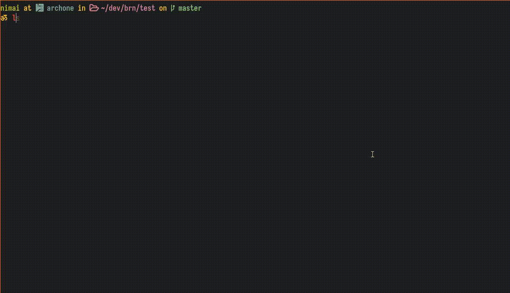

# bulk rename files

brn is a command line tool similar to [vimv](https://github.com/thameera/vimv/).
It can be used to easily mass-rename files in your preferred text editor (i.e.
vim).

## Usage
When called from inside a directory, it opens a buffer in your default text
editor with the list of filenames. You can then edit the filenames in the
buffer and the changes will take place when you save and exit.

By default it uses `$EDITOR` and if that is not set then `$VISUAL`.

## Install

### Arch Linux Users

You can use the `brn-git` aur package

```
paru -S brn-git
```

### Everyone else

Clone the repo and
```
sudo make install
```

## Why use brn over something like vimv?

* It can handle swapping names. It uses GNU/Linux's `renameat2` system call to
  atomically swap the names of two files which means no temporary files are made
  either (yes, this also means you can't compile it on other Unixes).

* It is written in C instead of bash which makes its behavior more robust and
  predictable.

* It has error handling, it will safely abort if the exact number of
  filenames isn't provided or if some filenames are repeated.

* It is free.

## Screencast



## TODO

- [x] Make an AUR package.

- [x] Version sort directory listing so initial buffer is similar to output of
`ls -Av`.

- [x] Add an example GIF 

## License
brn is licensed under the GNU AFFERO GENERAL PUBLIC LICENSE.
